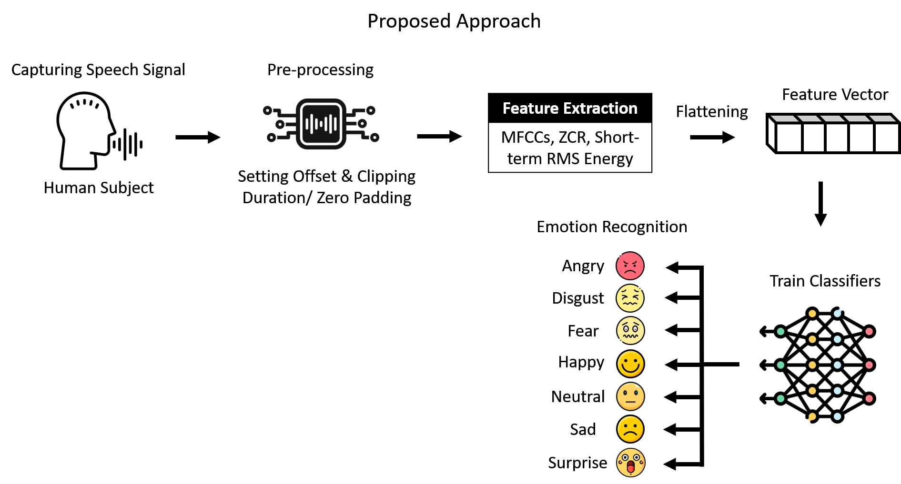
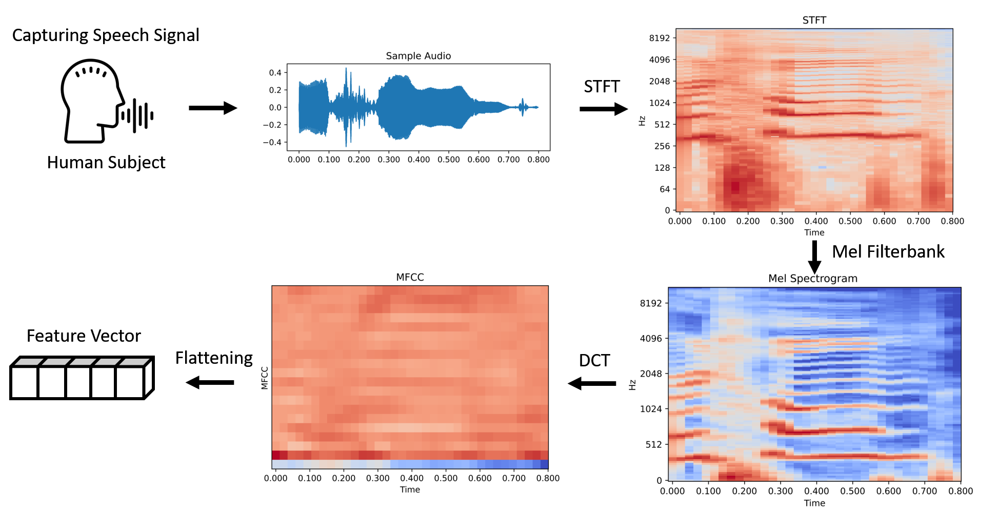

Speech Emotion Recognition (SER) using the CREMA-D dataset (https://www.kaggle.com/datasets/ejlok1/cremad).

The dataset was downsampled to 16 kHz for quicker processing and speech samples were kept into certain subfolders according to their emotional category.
Right now, the dataset is kept private as its a part of my M. Sc. (Engg) Thesis. After completion of the program, the dataset can be made available upon request.

We extracted three features from the speech samples, namely Mel-Frequency Cepstral Coefficients (MFCCs), Zero Crossing Rate (ZCR), and Short-term RMS Energy.
The MFCCs are considered to be the most important feature for speech data type. The MFCC feature extraction princple is depicted here:

Following, 8 machine learning models were run using a 5-fold cross-validation scheme to classify the emotional categories of the speech samples by leveraging the extracted features.
Logistic Regression, Random Forest, Support Vector Machine, XGBoost, Linear Discriminant Analysis, Ridge Classifier, SGD Classifier and Multi-layer Perceptron (ANN or Neural Network) were run.
Higest Performance wa attained by the SGD Classifier with a score of 99.73%, followed by MLP's 99.62% and Random Forest's 99.58%.

We obtained the following results:

Logistic Regression:
Fold Accuracy: 99.19%
Fold Accuracy: 99.46%
Fold Accuracy: 99.19%
Fold Accuracy: 99.33%
Fold Accuracy: 99.26%

Average Accuracy for Logistic Regression: 99.29%

        Overall Confusion Matrix for Logistic Regression:
      
        [[1271    0    0    0    0    0]
         [   0 1254   17    0    0    0]
         [   1   14 1247    2    0    7]
         [   8    2    0 1261    0    0]
         [   0    1    0    0 1086    0]
         [   0    1    0    0    0 1270]]
 
        Overall Classification Report for Logistic Regression:

              precision    recall  f1-score   support

       Anger       0.99      1.00      1.00      1271
     Disgust       0.99      0.99      0.99      1271
        Fear       0.99      0.98      0.98      1271
       Happy       1.00      0.99      1.00      1271
     Neutral       1.00      1.00      1.00      1087
         Sad       0.99      1.00      1.00      1271

    accuracy                           0.99      7442
    macro avg      0.99      0.99      0.99      7442
    weighted avg   0.99      0.99      0.99      7442

Random Forest:
Fold Accuracy: 99.46%
Fold Accuracy: 99.53%
Fold Accuracy: 99.73%
Fold Accuracy: 99.73%
Fold Accuracy: 99.46%

Average Accuracy for Random Forest: 99.58%

        Overall Confusion Matrix for Random Forest:
        
        [[1269    1    0    1    0    0]
         [   0 1262    9    0    0    0]
         [   1    3 1267    0    0    0]
         [   9    2    0 1260    0    0]
         [   1    1    0    0 1085    0]
         [   0    0    3    0    0 1268]]
 
        Overall Classification Report for Random Forest:

              precision    recall  f1-score   support

       Anger       0.99      1.00      0.99      1271
     Disgust       0.99      0.99      0.99      1271
        Fear       0.99      1.00      0.99      1271
       Happy       1.00      0.99      1.00      1271
     Neutral       1.00      1.00      1.00      1087
         Sad       1.00      1.00      1.00      1271

    accuracy                           1.00      7442
    macro avg      1.00      1.00      1.00      7442
    weighted avg   1.00      1.00      1.00      7442

SVM:
Fold Accuracy: 98.99%
Fold Accuracy: 99.06%
Fold Accuracy: 98.59%
Fold Accuracy: 99.13%
Fold Accuracy: 99.19%
Average Accuracy for SVM: 98.99%

        Overall Confusion Matrix for SVM:
        
        [[1271    0    0    0    0    0]
         [  13 1255    3    0    0    0]
         [  17    2 1252    0    0    0]
         [  28    0    0 1243    0    0]
         [   3    2    0    0 1082    0]
         [   6    1    0    0    0 1264]]
 
        Overall Classification Report for SVM:

              precision    recall  f1-score   support

       Anger       0.95      1.00      0.97      1271
     Disgust       1.00      0.99      0.99      1271
        Fear       1.00      0.99      0.99      1271
       Happy       1.00      0.98      0.99      1271
     Neutral       1.00      1.00      1.00      1087
         Sad       1.00      0.99      1.00      1271

    accuracy                           0.99      7442
    macro avg      0.99      0.99      0.99      7442
    weighted avg   0.99      0.99      0.99      7442

XGBoost:
Fold Accuracy: 99.46%
Fold Accuracy: 99.40%
Fold Accuracy: 99.60%
Fold Accuracy: 99.33%
Fold Accuracy: 99.53%

Average Accuracy for XGBoost: 99.46%

        Overall Confusion Matrix for XGBoost:
        
        [[1267    1    0    0    2    1]
         [   0 1258   12    1    0    0]
         [   0    3 1267    0    0    1]
         [   9    4    1 1257    0    0]
         [   1    0    0    0 1086    0]
         [   0    0    4    0    0 1267]]
 
        Overall Classification Report for XGBoost:

              precision    recall  f1-score   support

       Anger       0.99      1.00      0.99      1271
     Disgust       0.99      0.99      0.99      1271
        Fear       0.99      1.00      0.99      1271
       Happy       1.00      0.99      0.99      1271
     Neutral       1.00      1.00      1.00      1087
         Sad       1.00      1.00      1.00      1271

    accuracy                           0.99      7442
    macro avg      0.99      0.99      0.99      7442
    weighted avg   0.99      0.99      0.99      7442

Linear Discriminant Analysis:
Fold Accuracy: 98.52%
Fold Accuracy: 98.39%
Fold Accuracy: 98.39%
Fold Accuracy: 98.79%
Fold Accuracy: 98.12%

Average Accuracy for Linear Discriminant Analysis: 98.44%

        Overall Confusion Matrix for Linear Discriminant Analysis:
        
        [[1240    3    2   13   12    1]
         [   0 1224   38    5    4    0]
         [   1    9 1253    1    0    7]
         [   2    4    1 1259    4    1]
         [   1    3    1    0 1082    0]
         [   0    1    2    0    0 1268]]
 
        Overall Classification Report for Linear Discriminant Analysis:

              precision    recall  f1-score   support

       Anger       1.00      0.98      0.99      1271
     Disgust       0.98      0.96      0.97      1271
        Fear       0.97      0.99      0.98      1271
       Happy       0.99      0.99      0.99      1271
     Neutral       0.98      1.00      0.99      1087
         Sad       0.99      1.00      1.00      1271

    accuracy                           0.98      7442
    macro avg      0.98      0.98      0.98      7442
    weighted avg   0.98      0.98      0.98      7442

Ridge Classifier:
Fold Accuracy: 98.52%
Fold Accuracy: 97.65%
Fold Accuracy: 97.58%
Fold Accuracy: 98.19%
Fold Accuracy: 98.39%

Average Accuracy for Ridge Classifier: 98.07%

        Overall Confusion Matrix for Ridge Classifier:
        
        [[1239   10    7    9    4    2]
         [   0 1203   57   10    1    0]
         [   1   16 1247    3    0    4]
         [   1    3    7 1259    1    0]
         [   0    3    0    0 1084    0]
         [   0    1    4    0    0 1266]]
 
        Overall Classification Report for Ridge Classifier:

              precision    recall  f1-score   support

       Anger       1.00      0.97      0.99      1271
     Disgust       0.97      0.95      0.96      1271
        Fear       0.94      0.98      0.96      1271
       Happy       0.98      0.99      0.99      1271
     Neutral       0.99      1.00      1.00      1087
         Sad       1.00      1.00      1.00      1271

    accuracy                           0.98      7442
    macro avg      0.98      0.98      0.98      7442
    weighted avg   0.98      0.98      0.98      7442

SGD Classifier:
Fold Accuracy: 99.66%
Fold Accuracy: 99.66%
Fold Accuracy: 99.93%
Fold Accuracy: 99.80%
Fold Accuracy: 99.60%

Average Accuracy for SGD Classifier: 99.73%

      Overall Confusion Matrix for SGD Classifier:
      
        [[1269    0    0    2    0    0]
         [   1 1264    5    1    0    0]
         [   0    6 1264    1    0    0]
         [   2    0    0 1269    0    0]
         [   0    1    0    0 1086    0]
         [   0    1    0    0    0 1270]]
 
        Overall Classification Report for SGD Classifier:

              precision    recall  f1-score   support

       Anger       1.00      1.00      1.00      1271
     Disgust       0.99      0.99      0.99      1271
        Fear       1.00      0.99      1.00      1271
       Happy       1.00      1.00      1.00      1271
     Neutral       1.00      1.00      1.00      1087
         Sad       1.00      1.00      1.00      1271

    accuracy                           1.00      7442
    macro avg      1.00      1.00      1.00      7442
    weighted avg   1.00      1.00      1.00      7442

MLP (Neural Network):
Fold Accuracy: 99.53%
Fold Accuracy: 99.53%
Fold Accuracy: 99.87%
Fold Accuracy: 99.60%
Fold Accuracy: 99.60%

Average Accuracy for MLP (Neural Network): 99.62%

        Overall Confusion Matrix for MLP (Neural Network):
        
        [[1269    1    0    1    0    0]
         [   1 1261    7    2    0    0]
         [   2    7 1261    0    0    1]
         [   3    1    0 1267    0    0]
         [   0    2    0    0 1085    0]
         [   0    0    0    0    0 1271]]
 
        Overall Classification Report for MLP (Neural Network):

              precision    recall  f1-score   support

       Anger       1.00      1.00      1.00      1271
     Disgust       0.99      0.99      0.99      1271
        Fear       0.99      0.99      0.99      1271
       Happy       1.00      1.00      1.00      1271
     Neutral       1.00      1.00      1.00      1087
         Sad       1.00      1.00      1.00      1271

    accuracy                           1.00      7442
    macro avg      1.00      1.00      1.00      7442
    weighted avg   1.00      1.00      1.00      7442
